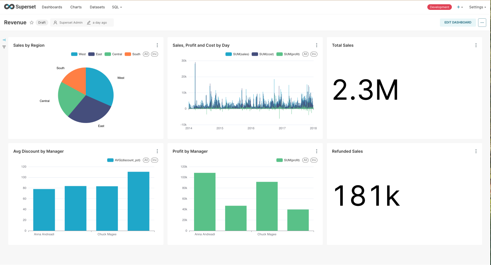

# Data Engineer Assessment

## Project Description

Outlined below is a sample assignment designed to test your abilities as a data engineer. You will be introduced to a hypothetical company situation, provided access to a fictional data set, and given a set of requirements to complete. The assignment is limited in scope to just the data and information you are provided below you will not be required to source any additional data or information outside the content in this document. Submission instructions will be provided at the end.

## Assignment

You have just joined the Poplin Office Supplies Company (POSC), a traditional company that does corporate sales of office supplies from their catalog direct to other businesses. The business model for POSC is a traditional sales lead operation where regional managers sell directly to business customers in their assigned regions. The company has had no real time understanding of their performance over the years but has just recently set up a database that streams all their past and present order information. You have been hired to help them with their business intelligence by building a data engineering pipeline for the data analysts to help them with their sales data analysis. This team has no experience with data and so aside from a couple core metrics they feel are important to track, they have no other idea what would be important for them to really measure to understand their business.

A sample database is provided, you can start it up with docker compose and connect to it to view the data.

The data contains three tables; order, managers, and returns. Managers control regions and customers in orders are identified by region. Managers also have the ability to negotiate sales prices and that is reflected in the orders table by a percentage discount applied. Sometimes not all sales are profitable though and the net profit is reflected in the profits column. Refunds represent a full refund of the total sale amount.

You have been asked to support the data engineering team to move and enrich this data from the database to an analytics warehouse. Provide an ELT or ETL solution to support this data team initiative.

## Requirements

- Create a separate warehouse database to store your transformed data.
- You can use whatever technologies and languages for your solution.
- You will be required to define a schema in the warehouse for the data.
- Introduce any other additional metrics or enrichments that you think would help the data analysts construct their BI dashboards.
- You’re encouraged to spend at least 2 hours on the dashboard but avoid going over 5 hours.

## Submission

Share your solution with https://github.com/rarescrisan and notify rares@poplin.co and the assignment provider on completion.

## Poplin Office Supplies - Data Engineering Solution

### Overview

This repository contains a complete data engineering solution for Poplin Office Supplies Company (POSC). The solution includes:

- Database Integration: ETL/ELT pipelines to process and enrich sales data from the POSC database.
- Data Modeling: Using dbt to create models for data analysis and visualization.
- Orchestration: Using Apache Airflow to automate data pipeline workflows.
- Visualization: Using Apache Superset to create dashboards for business intelligence.

### Solution Architecture

The solution extracts data from a transactional source database (poplin-store) and loads it into a data warehouse (warehouse). The warehouse serves as the analytics layer, hosting dbt models for transformation and enriched datasets for visualization in Superset.

### Components

- PostgreSQL: Source database (poplin-store) and analytics warehouse (warehouse).
- Apache Airflow: Orchestrates dbt runs and ensures data freshness.
- dbt: Transforms raw data into actionable datasets.
- Apache Superset: Provides interactive dashboards for business analysis.

### Features

- Data Pipelines: Incremental loading of data from poplin-store to warehouse.
- Enrichment of raw data using dbt models (e.g., calculating discounts, aggregating sales by manager).
- Orchestration: Airflow schedules data pipelines and ensures data models are up-to-date every 5 minutes.
- Metrics & KPIs: Discount percentage, sales performance, refund rates, and profitability metrics.

## Getting Started

### Install Docker

Ensure Docker and Docker Compose are installed.

### Clone the Repository

```bash
git clone https://github.com/GuiBo79/poplin-data-pipeline
cd poplin-data-pipeline
```

### Running the Solution

Run the following command to start all services:

```bash
docker-compose up --build
```

### Services and URLs

#### Airflow

```
URL: http://localhost:8080
Username: admin
Password: admin
```

#### Superset

```
URL: http://localhost:8088
Username: admin
Password: admin
```

#### Source Database (Postgres)

```
Host: localhost
Port: 54325
Database: poplin-store
Username: postgres
Password: secretpassword
```

#### Warehouse Database (Postgres)

```
Host: localhost
Port: 54326
Database: warehouse
Username: postgres
Password: secretpassword
```

### Initialize Airflow

Airflow initializes automatically when you run the application. The dbt_run_with_tests DAG runs every 5 minutes to keep the models fresh.

### Superset Configuration

Superset is preconfigured with:

- A connection to the warehouse database.

### Using the Application

#### Access Airflow

Navigate to http://localhost:8080.

#### Enable DAGs

- dbt_run_with_tests: Runs dbt models and tests periodically.
- Ensure the DAGs are enabled to process data automatically.

#### Access Superset

Navigate to http://localhost:8088.

#### Explore Dashboards (Dashboards have to be created manually or imported after first Airflow Run)
[Dashboard Sample](superset/dashboards/dashboard_export_20250126T210328.zip)

View interactive dashboards.



#### Add Custom Charts

Use the int_discount_by_manager or other datasets in the Superset UI.

## Folder Structure

```plaintext
├── airflow/                     # Airflow DAGs and configuration
│   ├── dags/
│   │   ├── dbt_run_dag.py       # DAG to run dbt models
├── database/                    # Source database setup
│   ├── seed_data.sql            # Seed data for poplin-store
├── dbt/                         # dbt project
│   ├── models/
│   │   ├── staging/             # Raw staging models
│   │   ├── intermediate/        # Intermediate models
│   │   ├── marts/               # Final business-facing models
│   ├── macros/                  # Custom macros
│   ├── dbt_project.yml          # dbt project configuration
├── superset/                    # Superset configuration
│   ├── dashboards/              # JSON exports of dashboards
│   │   ├── revenue.json         # Discount by Manager dashboard
├── docker-compose.yml           # Docker Compose configuration
└── README.md                    # This file
```

## Key Metrics & Transformations

### Discount Percentage

- Macro: calculate_discount.
- Formula: (Sales - Profit) / Sales * 100.

### Refund Rate

- Refunds as a percentage of total sales.

### Discount by Manager

- Aggregates average discounts and total sales per manager.

## Troubleshooting

### Airflow Webserver Fails to Start

- Ensure Docker has proper permissions to access the host.
- Restart services:

```bash
docker-compose down
docker-compose up --build
```

### Superset Database Connection Issues

- Verify the warehouse connection in Superset:
  - Navigate to Settings > Database Connections.
- Ensure the database is reachable using:

```bash
psql -h localhost -p 54326 -U postgres -d warehouse
```

### Models Failing in dbt

- Debug the error with:

```bash
dbt debug
dbt run --select <failing_model>
```

## Points of Improvement

- Connect to a Datalake
- Add Spark/Hadoop for heavy workloads
- K8s Deployment Support for fast scaling
- Deploy Airflow using K8s executors
- Add prod web server and robust db to Apache Superset

## Contributors

- [Gui Bortolaso](https://github.com/GuiBo79)
- For questions or issues, please reach out to gui.bortolaso@gmail.com .

